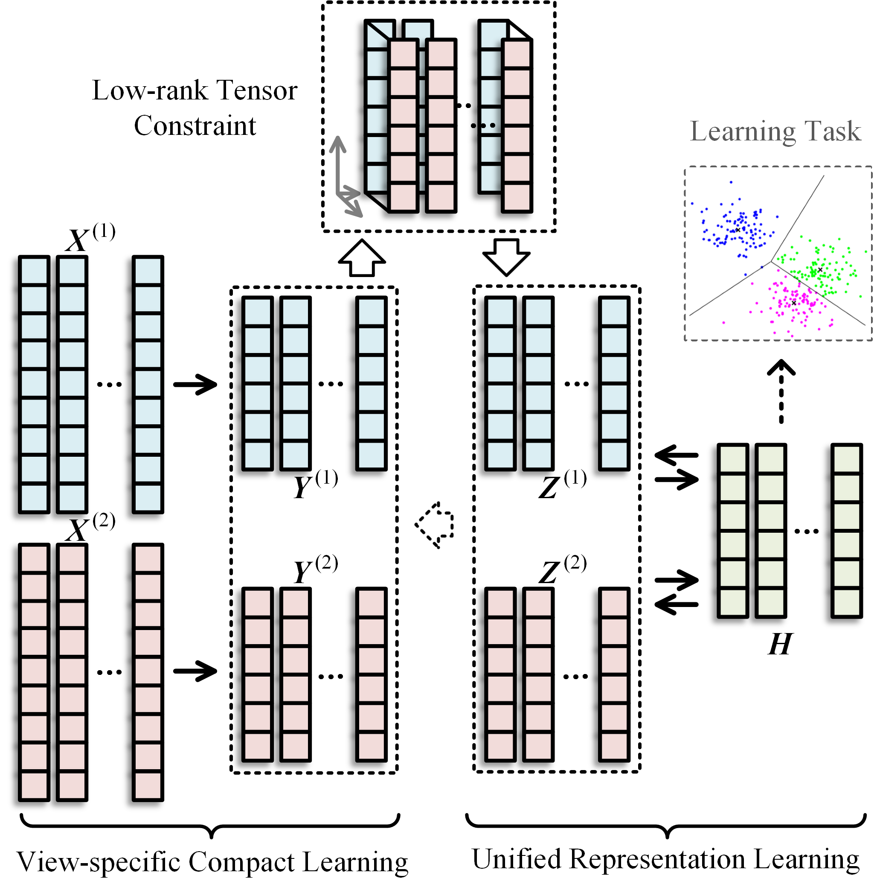

# CUMRL
Source codes of "Collaborative Unsupervised Multi-view Representation Learning" pubilished in IEEE TCSVT 2021

If you find the codes useful in your research, please cite our work as follows, thanks.

@article\{CUMRLTCSVT2021, 
      &nbsp;&nbsp;&nbsp;&nbsp;title=\{Collaborative Unsupervised Multi-view Representation Learning\}, 
      &nbsp;&nbsp;&nbsp;&nbsp;author=\{Zheng, Qinghai and Zhu, Jihua and Li, Zhongyu\}, 
      &nbsp;&nbsp;&nbsp;&nbsp;journal=\{IEEE Transactions on Circuits and Systems for Video Technology\}, 
      &nbsp;&nbsp;&nbsp;&nbsp;year=\{2021\}, 
      &nbsp;&nbsp;&nbsp;&nbsp;volume=\{32\}, 
      &nbsp;&nbsp;&nbsp;&nbsp;number=\{7\}, 
      &nbsp;&nbsp;&nbsp;&nbsp;pages=\{4202-4210\}, 
      &nbsp;&nbsp;&nbsp;&nbsp;doi=\{10.1109/TCSVT.2021.3127007\} 
\} 

Email: qhxjtu@163.com
